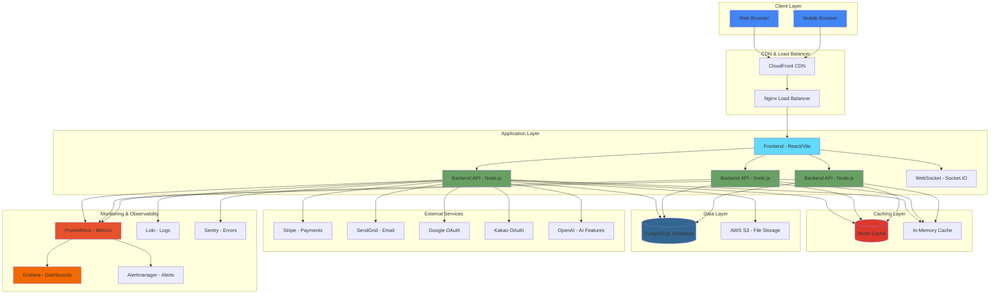
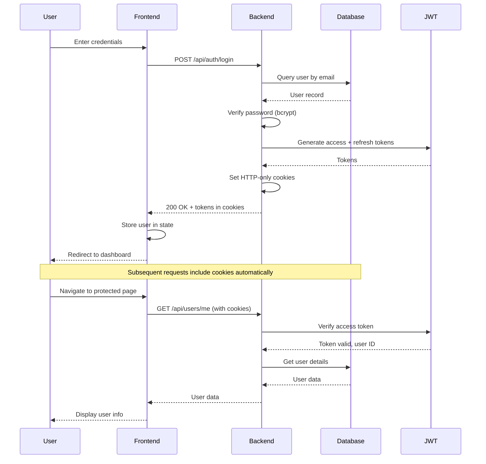
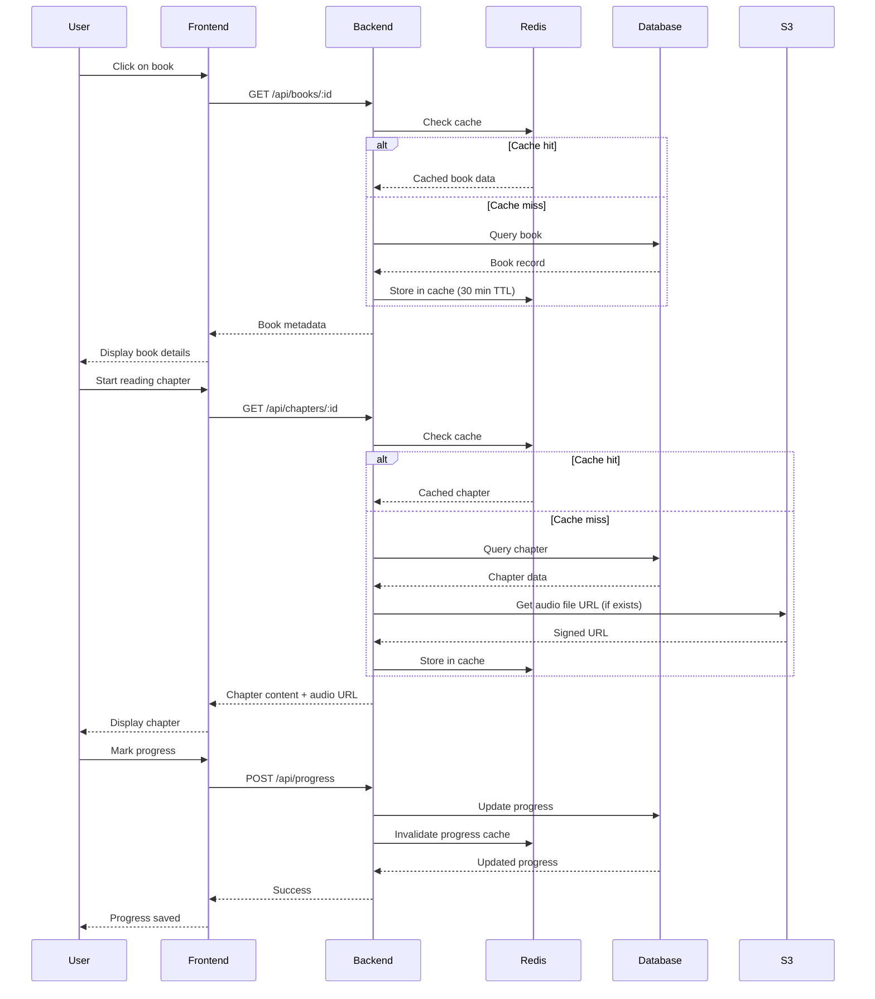
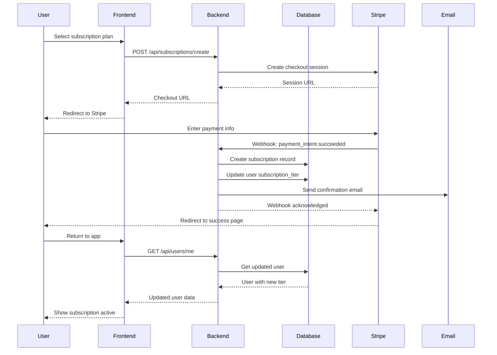
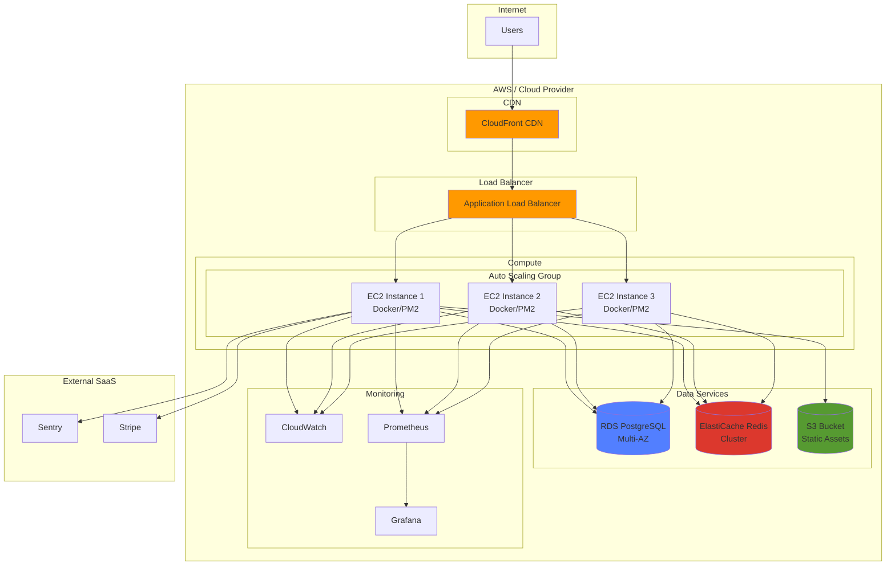
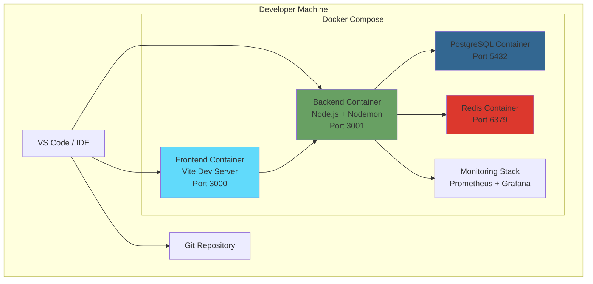
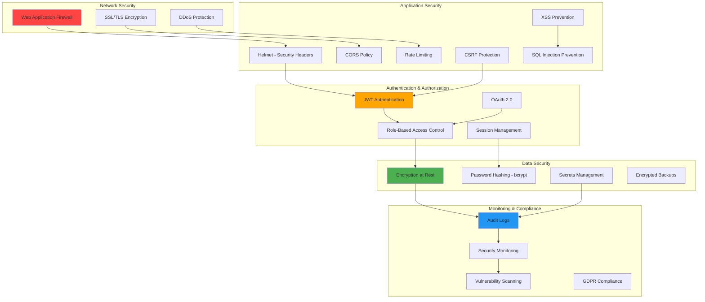

# System Architecture Documentation
## Education Platform 2025

Last Updated: 2025-11-25

---

## Table of Contents

1. [High-Level Architecture](#high-level-architecture)
2. [Component Architecture](#component-architecture)
3. [Data Flow](#data-flow)
4. [Infrastructure Architecture](#infrastructure-architecture)
5. [Security Architecture](#security-architecture)
6. [Monitoring Architecture](#monitoring-architecture)

---

## High-Level Architecture



---

## Component Architecture

### Frontend Architecture

```mermaid
graph TB
    subgraph "React Application"
        Router[React Router]

        subgraph "Pages"
            Home[Home Page]
            Books[Books Page]
            Reader[Book Reader]
            Dashboard[User Dashboard]
            Auth[Auth Pages]
        end

        subgraph "State Management"
            Query[TanStack Query - Server State]
            Zustand[Zustand - Client State]
        end

        subgraph "UI Components"
            Layout[Layout Components]
            Forms[Form Components]
            Cards[Card Components]
            Modals[Modal Components]
        end

        subgraph "Utilities"
            API[API Client - Axios]
            Auth_Utils[Auth Utilities]
            Hooks[Custom Hooks]
        end
    end

    Router --> Home
    Router --> Books
    Router --> Reader
    Router --> Dashboard
    Router --> Auth

    Home --> Layout
    Home --> Cards
    Books --> Layout
    Books --> Cards
    Reader --> Layout
    Dashboard --> Layout
    Dashboard --> Forms

    Home --> Query
    Books --> Query
    Reader --> Query
    Dashboard --> Query

    Query --> API
    Auth --> Auth_Utils
    API --> Auth_Utils

    style Router fill:#61DAFB
    style Query fill:#FF4154
    style Zustand fill:#443E38
    style API fill:#5A29E4
```



### Backend Architecture

```mermaid
graph TB
    subgraph "Express Application"
        Server[Express Server]

        subgraph "Middleware Layer"
            CORS[CORS]
            Helmet[Helmet - Security]
            RateLimit[Rate Limiter]
            Auth[JWT Auth]
            CSRF[CSRF Protection]
            Metrics[Metrics Collection]
            Cache[Cache Middleware]
            Logger[Request Logger]
        end

        subgraph "Routes"
            AuthRoute[/auth - Authentication]
            UserRoute[/users - User Management]
            BookRoute[/books - Book Catalog]
            ProgressRoute[/progress - Learning Progress]
            SubRoute[/subscriptions - Subscriptions]
            PaymentRoute[/payments - Payments]
            AIRoute[/ai - AI Features]
        end

        subgraph "Services"
            AuthService[Auth Service]
            UserService[User Service]
            BookService[Book Service]
            PaymentService[Payment Service]
            EmailService[Email Service]
            AIService[AI Service]
        end

        subgraph "Data Access"
            DB_Pool[Database Pool]
            Redis_Client[Redis Client]
            S3_Client[S3 Client]
        end
    end

    Server --> CORS
    CORS --> Helmet
    Helmet --> RateLimit
    RateLimit --> Auth
    Auth --> CSRF
    CSRF --> Metrics
    Metrics --> Cache
    Cache --> Logger

    Logger --> AuthRoute
    Logger --> UserRoute
    Logger --> BookRoute
    Logger --> ProgressRoute
    Logger --> SubRoute
    Logger --> PaymentRoute
    Logger --> AIRoute

    AuthRoute --> AuthService
    UserRoute --> UserService
    BookRoute --> BookService
    SubRoute --> PaymentService
    PaymentRoute --> PaymentService
    AIRoute --> AIService

    AuthService --> DB_Pool
    UserService --> DB_Pool
    BookService --> DB_Pool
    PaymentService --> DB_Pool

    BookService --> Redis_Client
    BookService --> S3_Client
    AuthService --> EmailService

    style Server fill:#68A063
    style Auth fill:#FFA500
    style Metrics fill:#E6522C
    style Cache fill:#DC382D
    style DB_Pool fill:#336791
```

---

## Data Flow

### User Authentication Flow



### Book Reading Flow



### Payment Processing Flow



---

## Infrastructure Architecture

### Production Deployment



### Development Environment



---

## Security Architecture

### Security Layers



---

## Monitoring Architecture

### Observability Stack

```mermaid
graph TB
    subgraph "Application"
        App1[Backend Instance 1]
        App2[Backend Instance 2]
        App3[Backend Instance 3]
        Frontend_App[Frontend]
    end

    subgraph "Metrics Collection"
        Prom[Prometheus]
        Node_Exporter[Node Exporter]
        Postgres_Exporter[Postgres Exporter]
        Redis_Exporter[Redis Exporter]
        cAdvisor[cAdvisor]
    end

    subgraph "Log Aggregation"
        Promtail[Promtail]
        Loki_Server[Loki]
    end

    subgraph "Error Tracking"
        Sentry_Backend[Sentry - Backend]
        Sentry_Frontend[Sentry - Frontend]
    end

    subgraph "Visualization"
        Grafana[Grafana]
        subgraph "Dashboards"
            API_Dashboard[API Overview]
            DORA_Dashboard[DORA Metrics]
            System_Dashboard[System Metrics]
            Business_Dashboard[Business Metrics]
        end
    end

    subgraph "Alerting"
        Alertmanager[Alertmanager]
        subgraph "Channels"
            Slack[Slack]
            Email_Alert[Email]
            PagerDuty[PagerDuty]
        end
    end

    App1 --> Prom
    App2 --> Prom
    App3 --> Prom
    Frontend_App --> Sentry_Frontend

    Node_Exporter --> Prom
    Postgres_Exporter --> Prom
    Redis_Exporter --> Prom
    cAdvisor --> Prom

    App1 --> Promtail
    App2 --> Promtail
    App3 --> Promtail
    Promtail --> Loki_Server

    App1 --> Sentry_Backend
    App2 --> Sentry_Backend
    App3 --> Sentry_Backend

    Prom --> Grafana
    Loki_Server --> Grafana
    Grafana --> API_Dashboard
    Grafana --> DORA_Dashboard
    Grafana --> System_Dashboard
    Grafana --> Business_Dashboard

    Prom --> Alertmanager
    Alertmanager --> Slack
    Alertmanager --> Email_Alert
    Alertmanager --> PagerDuty

    style Prom fill:#E6522C
    style Grafana fill:#F46800
    style Loki_Server fill:#F9B716
    style Sentry_Backend fill:#362D59
    style Alertmanager fill:#E25822
```



---

## Technology Stack Summary

### Frontend
- **Framework:** React 18 with TypeScript
- **Build Tool:** Vite
- **State Management:** TanStack Query + Zustand
- **Styling:** Tailwind CSS
- **Animations:** Framer Motion
- **Routing:** React Router v6

### Backend
- **Runtime:** Node.js 20
- **Framework:** Express.js
- **Database:** PostgreSQL 15
- **Caching:** Redis 7
- **Authentication:** JWT + OAuth 2.0 (Google, Kakao)
- **Real-time:** Socket.IO
- **Logging:** Winston

### Infrastructure
- **Containerization:** Docker + Docker Compose
- **Process Manager:** PM2 (alternative to Docker)
- **Web Server:** Nginx
- **Monitoring:** Prometheus + Grafana + Loki
- **Error Tracking:** Sentry
- **CI/CD:** GitHub Actions

### External Services
- **Payments:** Stripe
- **Email:** SendGrid
- **Storage:** AWS S3
- **AI:** OpenAI GPT-4
- **CDN:** CloudFront (optional)

---

## Architecture Principles

### Design Principles

1. **Separation of Concerns**
   - Frontend handles UI/UX
   - Backend handles business logic
   - Database handles data persistence
   - Cache handles performance

2. **Scalability**
   - Stateless backend (horizontal scaling)
   - Database connection pooling
   - Redis caching layer
   - CDN for static assets

3. **Resilience**
   - Graceful degradation
   - Health checks and auto-recovery
   - Circuit breakers for external services
   - Comprehensive error handling

4. **Security First**
   - Defense in depth
   - Least privilege access
   - Encryption at rest and in transit
   - Regular security audits

5. **Observability**
   - Comprehensive metrics
   - Structured logging
   - Distributed tracing ready
   - Proactive alerting

### Performance Targets

- **API Response Time:** <200ms (P95)
- **Database Query Time:** <100ms (P95)
- **Cache Hit Rate:** >80%
- **Frontend Load Time:** <2s (FCP)
- **Uptime:** >99.9%

---

## Related Documentation

- [Architecture Decision Records](adr/README.md) - Key architectural decisions
- [DEPLOYMENT.md](../DEPLOYMENT.md) - Deployment guide
- [ELITE_METHODOLOGY_CHECKLIST.md](../ELITE_METHODOLOGY_CHECKLIST.md) - Implementation status

---

**Last Updated:** 2025-11-25
**Maintained By:** Development Team
**Version:** 1.0
